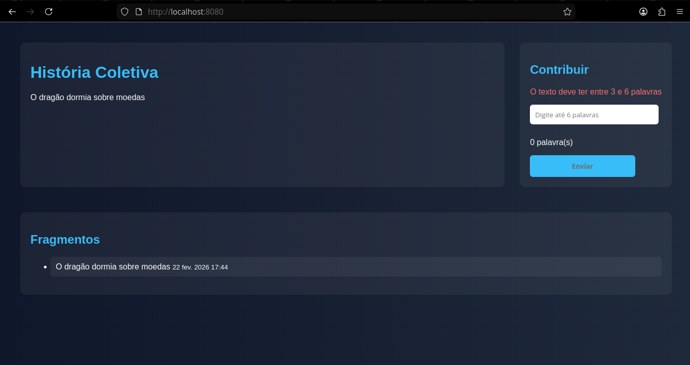
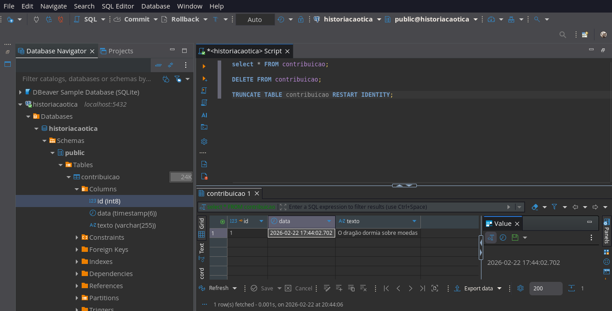

# História Caótica

Aplicação web desenvolvida com Spring Boot que implementa o padrão MVC com persistência em PostgreSQL, permitindo a construção colaborativa de uma história compartilhada.

---

## Demonstração

### Interface da Aplicação



### Banco de Dados (PostgreSQL)

Validação da persistência dos dados realizada no DBeaver após inserção de uma contribuição pela interface da aplicação.



---

## Objetivo

Demonstrar a integração entre:

- Camada Web (Spring MVC)
- Camada de Persistência (Spring Data JPA)
- Banco de Dados PostgreSQL
- Renderização com Thymeleaf

O projeto simula um ambiente colaborativo onde usuários adicionam trechos de texto a uma história compartilhada.

---

##  Tecnologias Utilizadas

- Java 17
- Spring Boot 4
- Spring MVC
- Spring Data JPA
- Thymeleaf
- PostgreSQL
- H2 Console (ambiente de desenvolvimento)
- Lombok
- Maven

---

## Estrutura da Aplicação

- `HomeController` → Controla requisições HTTP
- `Contribuicao` → Entidade JPA mapeada para o banco
- `ContributionRepository` → Interface que gerencia acesso aos dados
- Templates Thymeleaf → Renderização da interface

---

## Funcionalidades

- Inserção de novas contribuições
- Persistência em banco de dados
- Exibição das contribuições salvas
- Registro automático de data da contribuição

---

## Banco de Dados

A aplicação utiliza PostgreSQL como banco principal.

Estrutura da entidade:

- `id` (Long - auto gerado)
- `texto` (String)
- `data` (LocalDateTime)

Os dados foram validados utilizando DBeaver.

---

## Como Executar

### Configurar Banco

No `src/main/resources/application.properties`, configure:

```properties
spring.datasource.url=jdbc:postgresql://localhost:5432/historiacaotica
spring.datasource.username=postgres
spring.datasource.password=sua_senha

spring.jpa.hibernate.ddl-auto=update
spring.jpa.show-sql=true
spring.jpa.properties.hibernate.format_sql=true
```

### Executar aplicação
mvn spring-boot:run


### Acessar no navegador
http://localhost:8080

##  Aprendizados Técnicos

- Implementação do padrão MVC com separação de responsabilidades
- Persistência com Spring Data JPA e PostgreSQL
- Configuração manual de datasource
- Validação da integração aplicação ↔ banco via DBeaver
- Organização de projeto e documentação no GitHub

